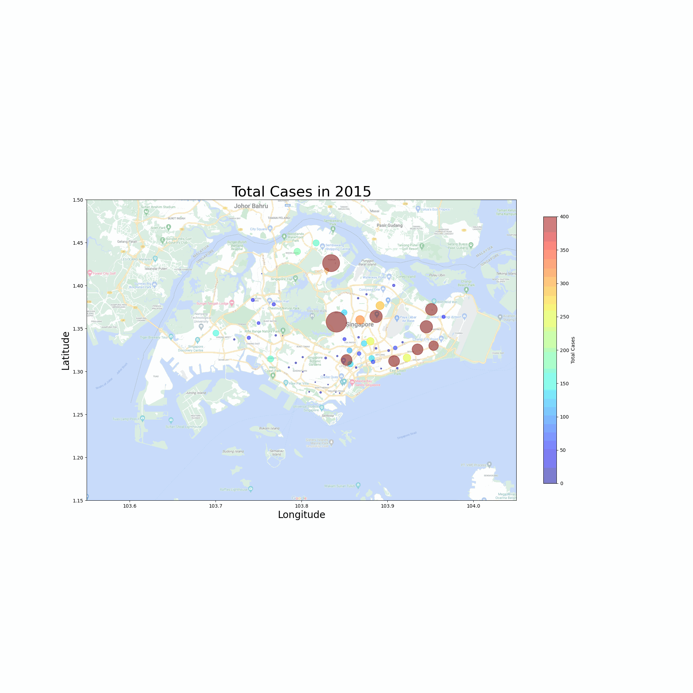
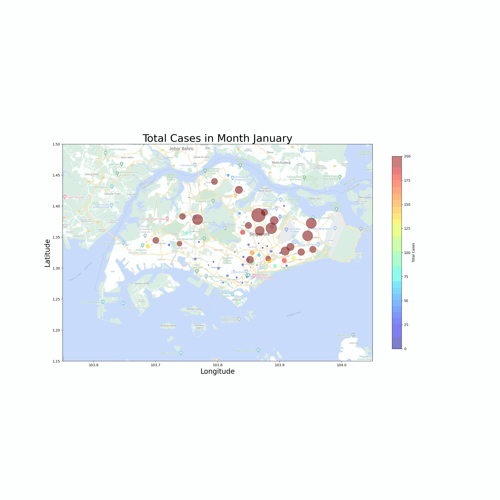

# Project 4: Predicting Dengue Cases in Singapore

---

> _“We will not be able to eradicate dengue (because) the constant weather extremes create the perfect breeding conditions for mosquitoes."_ 

    ~ Winston Chow (climate scientist), College of Integrative Studies, Singapore Management University

---
## Problem Statement
---

Dengue (dengue fever) is a disease that is endemic to Singapore. Despite constant efforts by the government and public to suppress its spread, Singapore continues to suffer from periodic outbreaks. In particular, outbreaks have been occurring at an increasing rate in recent years, with some years experiencing record-breaking numbers. Numerous factors are involved in influencing the spread of dengue and the resulting number of cases, thus making it difficult or virtually impossible to eradicate the virus; as a nation, we are constantly in 'defense-mode', ie., vector control measures are often carried out in a reactionary manner. In light of these challenges, our group has decided to tackle this challenge using a data-driven approach, where we aim to forecast future cases so as to provide an additional time advantage that we have over the virus. By doing so, we hope to imbue the National Environment Agency (NEA) with the confidence to carry out preventive measures at the earliest possible stage based on forecasts from our models, thus positively impacting the lives of Singaporeans as well as reducing associated costs with outbreaks, such as high costs incurred from aggressive vector control measures.

---
## Summary of Exploratory Data Analysis (EDA)
---

4 key factors appear to impact the spread of dengue cases:

1. Singapore’s tropical climate with year-round warm and humid days, alongside high precipitation levels, provides an optimal breeding ground for mosquitoes to thrive, thus indirectly encouraging the spread of dengue. 

2. Urbanisation in a globalised world can positively impact dengue numbers as well. Singapore is amongst the most densely populated nations in the world with a density of 7,810 people per sqm. In this way, the Aedes mosquito's tendency to stay within their own 'territories' might actually worsen things for us, since Singapore's residential estates are very densely packed.

3. External factors that are difficult to quantify or predict ahead of time can have far-reaching and detrimental effects as well. A good example is COVID-19 in 2020 , where, amongst other factors, the stay-in Circuit-Breaker period likely contributed heavily towards an unprecedented surge in case numbers, partially due to Aedes mosquitoes being day-biters who often reside in and around residential homes.

4. Singapore's constant fight against dengue works against us at times as well. For example, certain strains of dengue are rare in Singapore, thus leading to low herd immunity levels. A good example of this is DENV-3; experts suggested that a sudden rise in dominance of this particular strain was a leading factor in the drastic increase of dengue cases and outbreaks in recent years. 

5. Regions matter as well. For example, we found out that the East and North-East regions tend to suffer from worse dengue outbreaks compared to, for example, the West.

6. A clear pattern emerges when studying the nature of outbreaks, namely, that they tend to (although not always) peak sometime in the middle of the year. 

---
## Modelling
---

We experimented with and developed several models, the most successful of which were based on the following factors:
- Weather variables & information from Google search trends
- Year-on-year, weekly patterns within dengue cases

The models were evaluated on metrics relevant to the project as such as Root Mean Squared Error (RMSE) as well as Mean Absolute Percentage Error (MAPE). For example, in the 7-week period shown above from 2022 Weeks 15 to 21, the model achieved an RMSE of 86 and MAPE of 7.6%. 

---
## Cost-Benefit Analysis (CBA)
---

Despite good results achieved from the modelling process, we decided to go for a conservative estimate of potential impact. 

First, we generated the following figures for the first 42 weeks of 2022:

| Weeks | Actual | Predicted |
| --- | --- | --- |
| 1 to 7 | 1,132 | 957 | 
| 8 to 14 | 2,848 | 2,026 | 
| 15 to 21 | 7,683 | 8,105 | 
| 22 to 28 | 8,609 | 8,802 | 
| 29 to 35 | 5,825 | 5,772 | 
| 36 to 42 | 3,158 | 3,947 | 

Then, based on the above numbers and assuming an efficacy rate of 40% in terms of model implementation resulting in successful reduction of cases. This appears to be a rather conservative estimation because we strove to root it in reality by accounting for the following factors:

- End-users may (understandably) not wish to put all their eggs in one basket, ie., put all of their trust in predictions generated by a model;
- End-users may have expert domain knowledge that allows them to use the model as an additional source of information rather than the only one;
- Even with aggressive vector control or intervention measures, due to the factors mentioned above under EDA, it is ilikely impossible to drastically reduce case numbers, especially if an outbreak is to be expected (based on the model);
- While the overall actual vs predicted cases from weeks 1 to 42 are very similar (29,255 vs 29,609), each 7-week horizon has some fluctuations that may affect decision-making. For example, while the model was particularly successful in predicting the rising cases, peak outbreak as well as post-outbreak decline, it did not perform well for every single iteration, for example during weeks 8 to 14. This may or may not affect the way end-users deploy information obtained from the model.

We move on with the assumption of 40% efficacy, and decided to base our CBA on intervention via Project Wolbchia, which is one of the key vector control / intervention measures used by NEA in recent times. That is to say, we calculated the following based on the assumption that NEA would implement vector control measures in line with our predictions, namely Project Wolbachia, which would then result in a reduction of cases and their associated costs. The figures are as follows:

| Description | Estimated Costs (Original) | Estimated Costs (+ Model & Intervention) |
| Direct Costs (hospitalisation & treatment costs @ $3,500 per person) | $102M | $61.5M | 
| Indirect Costs (loss of productivity @ $3,500 per person) | $102M | $61.5M | 
| Project Wolbachia (deployment) | $0M | $40M | 
| Total Costs | $204M | $163M |

In summary, based on the model, we estimated that deployment of Project Wolbachia based on the model could result in a reduction of cases from 29,255 cases to 17,553 cases and result in cost-savings of around $41M ($205M - $163M).

---
## Conclusions and Recommendations
---

While the modelling process was, on a whole, relatively successful, we ambitiously propose that it could be improved on further, especially from help with the right stakeholders, such as expert users over at NEA.

Through the EDA & modelling process, we found out that while weather variables and patterns of dengue spread are predictors of future cases, there is a wealth of information out there that we could potentially harness on to build an even more robust model that would require minimal tweaking. As it stands, while the predictors mentioned are strong predictors, they do not account for sudden spikes and unexpectedly bad outbreaks (such as in 2020) because these outbreaks and case surges are due to external factors such as pandemics and change in serotype. In addition, these are exactly the 'type' of years that we will need the model to work well in because outbreaks are what we want to avoid, whether through the use of predictive forecasting models or aggressive deployment of vector control measures.

Thus, we propose that we could work hand-in-hand with NEA, and potentially other relevant stakeholders, to identify and _quantify_ other factors related to dengue, so as to be able to create and finetune a strong forecasting model that would be able to withstand the test of time.